# Screenshots

## App Settings
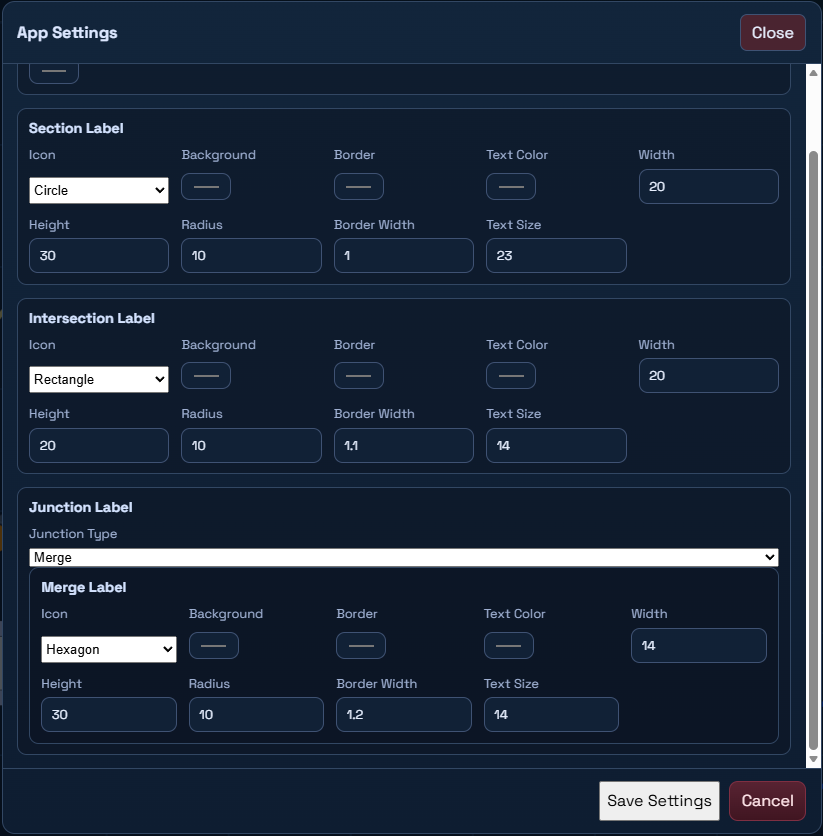

## Inspector
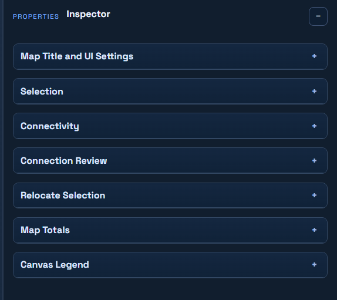

## Inspector - Other
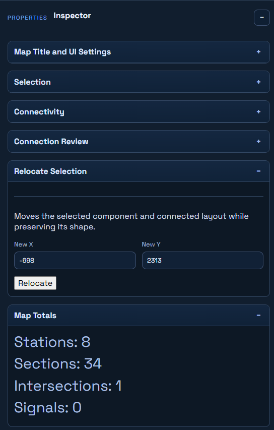

## Inspector - Section
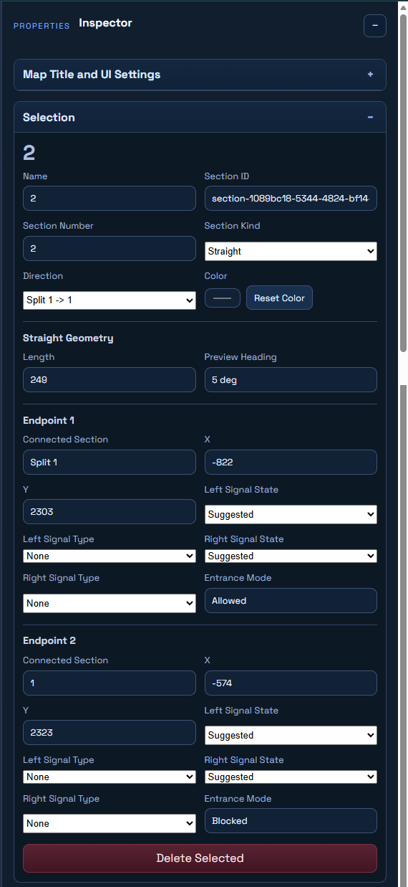

## Inspector - Section Connectivity
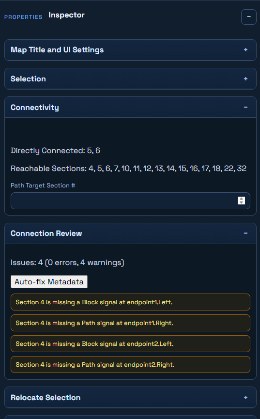

## Inspector - Train Station
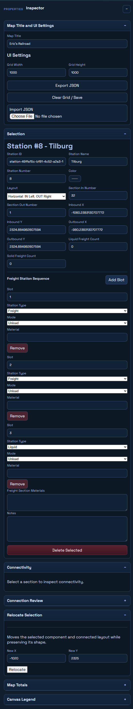

## Inspector - Train Station (2)
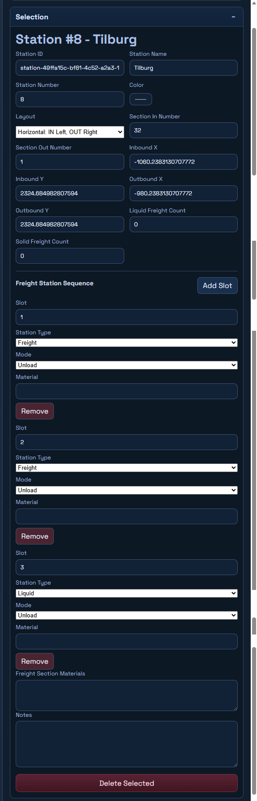

## Overview - Glyphs
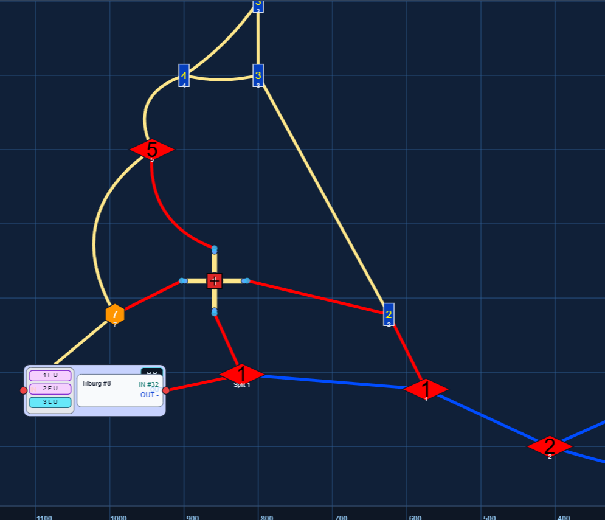

## Overview - Glyphs (2)
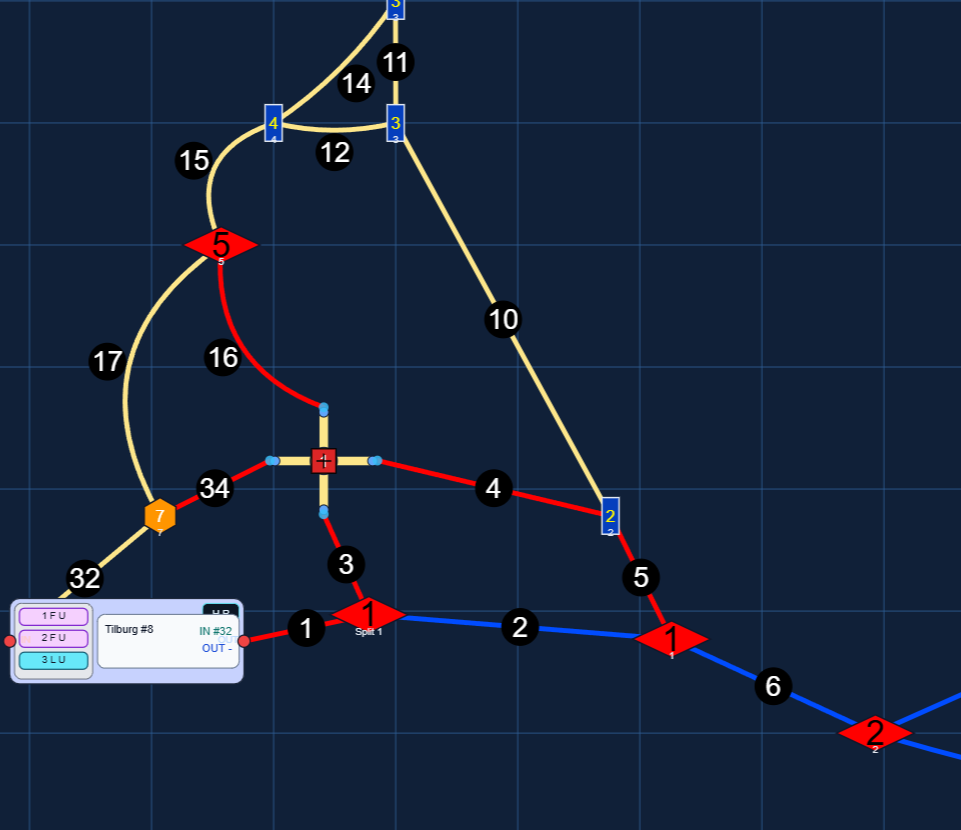

## Overview - Section
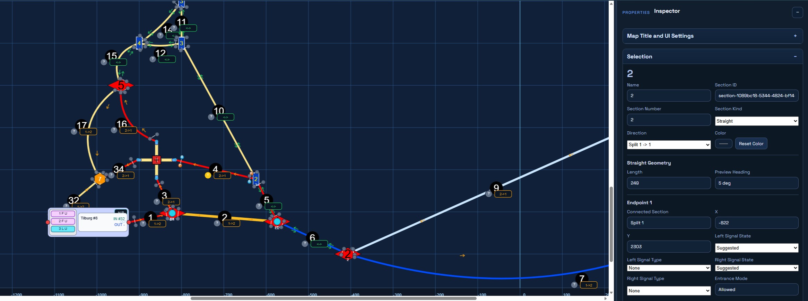

## Overview - Train Station
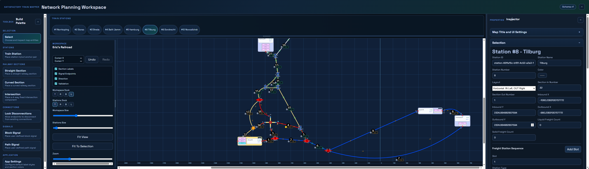

## Toolbox
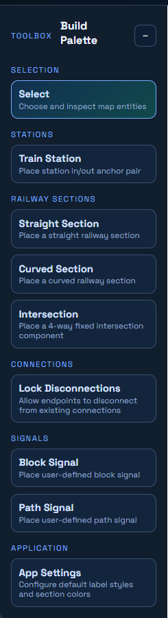

## Workspace Config
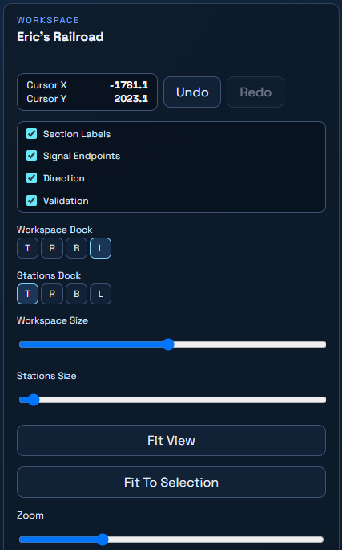

## Workspace Layout
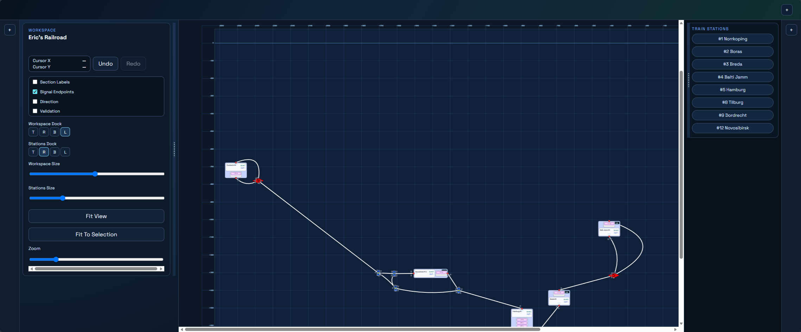
